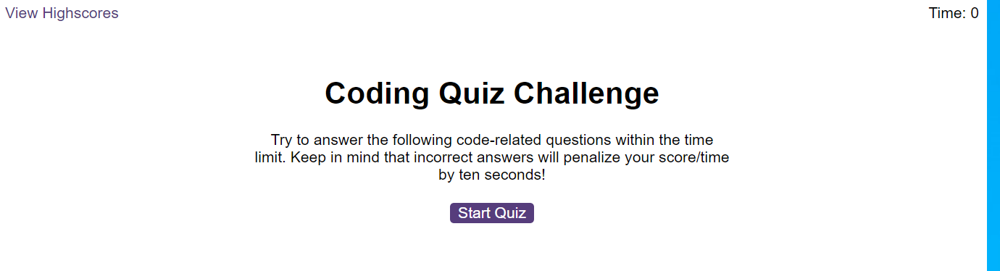
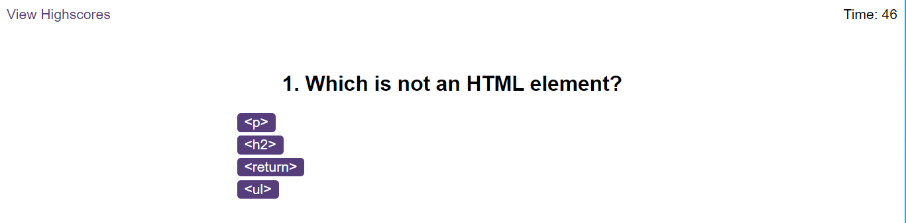
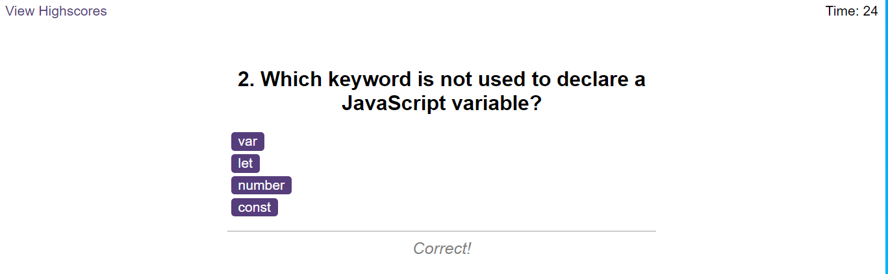
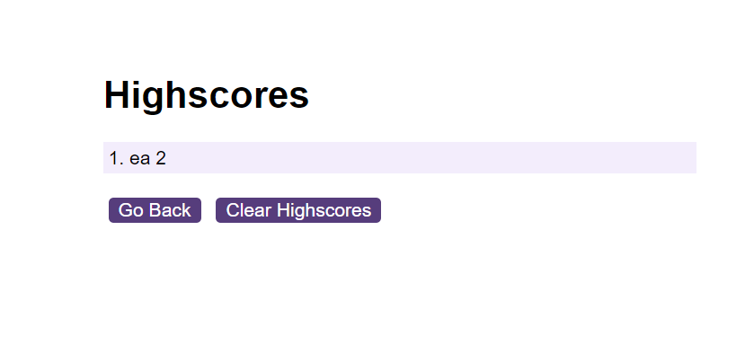

# Code-Quiz

A timed quiz on JavaScript fundamentals. 

## Description

A timed quiz on JavaScript fundamentals that stores high scores SO THAT you can gauge your progress compared to my peers

  
## Technologies Used
HTML5
JavaScript (ES6)
Git
GitHub
Visual Studio Code

## Installation

N/A

## Usage

* A start button that when clicked a timer starts and the first question appears.
 
  * Questions contain buttons for each answer.
  * 
  * When answer is clicked, the next question appears
  * 
  * If the answer clicked was incorrect then subtract time from the clock

* The quiz should end when all questions are answered or the timer reaches 0.

  * When the game ends, it should display their score and give the user the ability to save their initials and their score

The app is at the following URL:

https://github.com/jobmoonday/Code-Quiz

## Screenshots of the app

 

## Credits

N/A

## License

Please refer to the LICENCE in the repo.
